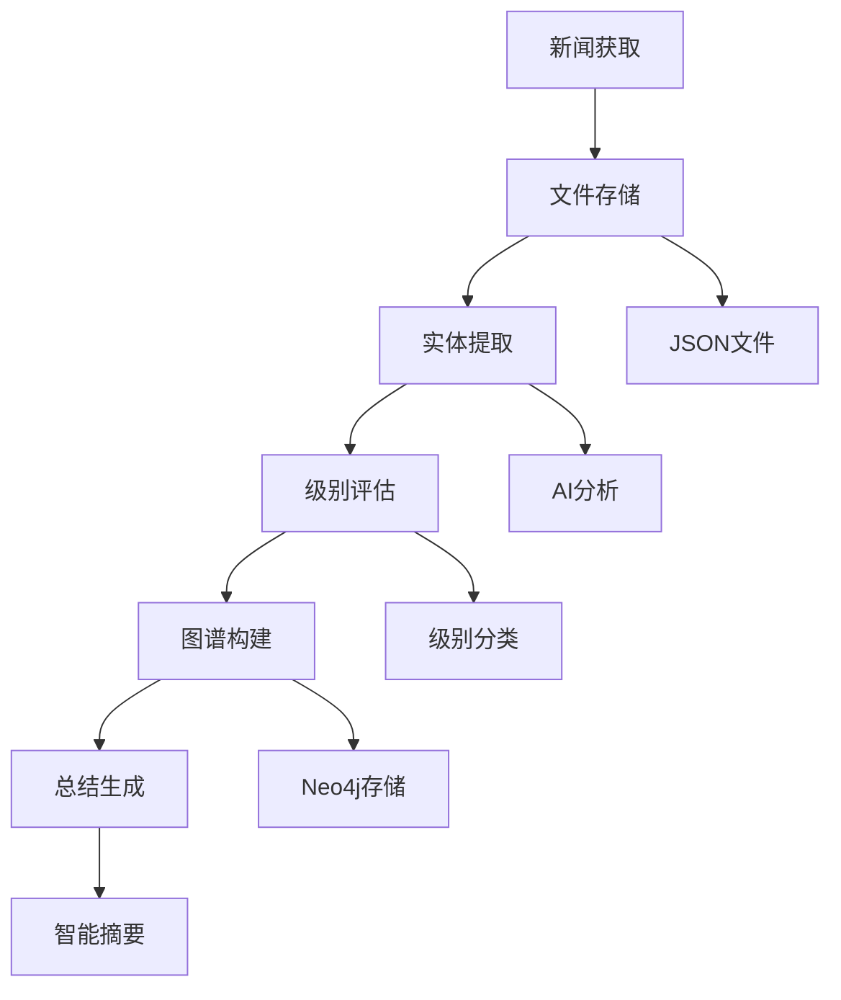

# 新闻知识图谱系统 - 项目文档

## 项目简介

这是一个基于AI的新闻处理和知识图谱系统，能够自动获取、处理、分析新闻数据，构建知识图谱，并提供智能总结和实时监控功能。系统采用前后端分离架构，后端负责数据处理和图谱构建，前端提供可视化查询界面。

## 系统架构

### 整体架构图

```
┌─────────────────┐    ┌─────────────────┐    ┌─────────────────┐
│   新闻API       │    │   文件存储       │    │   Neo4j数据库   │
│   (外部数据源)   │ ─→ │   (本地缓存)     │ ─→ │   (知识图谱)     │
└─────────────────┘    └─────────────────┘    └─────────────────┘
                                │                      │
                                ▼                      ▼
┌─────────────────────────────────────────────────────────────────┐
│                     后端服务 (Node.js)                          │
│  ┌─────────────┐ ┌─────────────┐ ┌─────────────┐ ┌─────────────┐ │
│  │ 新闻获取     │ │ 实体提取     │ │ 级别评估     │ │ 总结生成     │ │
│  └─────────────┘ └─────────────┘ └─────────────┘ └─────────────┘ │
│  ┌─────────────┐ ┌─────────────┐ ┌─────────────┐ ┌─────────────┐ │
│  │ 图谱构建     │ │ 关系抽取     │ │ 定时任务     │ │ CLI工具      │ │
│  └─────────────┘ └─────────────┘ └─────────────┘ └─────────────┘ │
└─────────────────────────────────────────────────────────────────┘
                                │
                                ▼ (REST API)
┌─────────────────────────────────────────────────────────────────┐
│                     前端应用 (Next.js)                          │
│  ┌─────────────┐ ┌─────────────┐ ┌─────────────┐ ┌─────────────┐ │
│  │ 数据概览     │ │ 新闻浏览     │ │ 图谱可视化   │ │ 总结报告     │ │
│  └─────────────┘ └─────────────┘ └─────────────┘ └─────────────┘ │
│  ┌─────────────┐ ┌─────────────┐                               │
│  │ 实时监控     │ │ 统计分析     │                               │
│  └─────────────┘ └─────────────┘                               │
└─────────────────────────────────────────────────────────────────┘
```

### 数据流程

```
新闻获取 → 文件存储 → 实体提取 → 级别评估 → 图谱构建 → 总结生成
    │         │         │         │         │         │
    ▼         ▼         ▼         ▼         ▼         ▼
  API调用   JSON文件   AI分析    级别分类   Neo4j存储  智能摘要
```

## 项目结构

```
drudge/                                    # 项目根目录
├── README.md                              # 项目说明文档
├── package.json                           # 后端依赖配置
├── tsconfig.json                          # TypeScript配置
├── ecosystem.config.js                    # PM2部署配置
├── nodemon.json                           # 开发环境配置
├── .env                                   # 环境变量配置
├── .gitignore                             # Git忽略文件
│
├── src/                                   # 后端源代码
│   ├── index.ts                           # 应用入口文件
│   │
│   ├── application/                       # 应用层
│   │   ├── services/                      # 业务服务
│   │   │   ├── core/                      # 核心服务
│   │   │   │   ├── NewsService.ts             # 新闻处理服务
│   │   │   │   ├── EntityService.ts          # 实体服务
│   │   │   │   └── RelationshipService.ts    # 关系服务
│   │   │   ├── business/                  # 业务服务
│   │   │   │   ├── QueryService.ts           # 查询服务
│   │   │   │   ├── NotificationService.ts    # 通知服务
│   │   │   │   ├── HourlySummaryService.ts   # 小时总结服务
│   │   │   │   ├── DailySummaryService.ts    # 每日总结服务
│   │   │   │   ├── HighLevelNewsScanner.ts   # 高级别新闻扫描
│   │   │   │   └── NewsLevelService.ts       # 新闻级别服务
│   │   │   ├── system/                    # 系统服务
│   │   │   │   ├── NewsAcquisitionService.ts # 新闻获取服务
│   │   │   │   └── SystemHealthService.ts   # 系统健康检查
│   │   │   ├── processing/                # 处理服务
│   │   │   │   ├── entityExtractionService.ts  # 实体提取服务
│   │   │   │   ├── extractors/                # 提取器
│   │   │   │   │   └── BaseExtractor.ts
│   │   │   │   └── processors/               # 处理器
│   │   │   │       ├── BatchProcessor.ts
│   │   │   │       ├── ResultProcessor.ts
│   │   │   │       └── SingleProcessor.ts
│   │   │   ├── KnowledgeGraphServiceV2.ts     # 知识图谱服务V2
│   │   │   └── NewsProcessingServiceV2.ts     # 新闻处理服务V2
│   │   └── use-cases/                     # 用例层
│   │       └── ProcessNewsUseCase.ts
│   │
│   ├── domain/                            # 领域层
│   │   ├── entities/                      # 实体定义
│   │   │   ├── index.ts                   # 实体索引
│   │   │   ├── Company.ts                 # 公司实体
│   │   │   ├── Person.ts                  # 人物实体
│   │   │   ├── Location.ts                # 地点实体
│   │   │   ├── Event.ts                   # 事件实体
│   │   │   ├── Time.ts                    # 时间实体
│   │   │   └── NewsExtractionResult.ts    # 新闻提取结果
│   │   ├── repositories/                  # 仓储接口
│   │   │   └── NewsRepository.ts
│   │   └── value-objects/                 # 值对象
│   │       └── NewsLevel.ts
│   │
│   ├── infrastructure/                    # 基础设施层
│   │   ├── database/                      # 数据库
│   │   │   ├── Neo4jRepository.ts         # Neo4j仓储
│   │   │   └── GraphRepository.ts         # 图数据库仓储
│   │   ├── external/                      # 外部服务
│   │   │   ├── NewsApiService.ts          # 新闻API服务
│   │   │   ├── AiService.ts               # AI服务
│   │   │   └── WebhookService.ts          # Webhook服务
│   │   ├── storage/                       # 存储
│   │   │   └── FileStorage.ts             # 文件存储
│   │   └── workers/                       # 工作线程
│   │       ├── newsProcessorWorker.ts     # 新闻处理工作线程
│   │       ├── schedulerWorker.ts         # 调度工作线程
│   │       ├── handlers/                  # 处理器
│   │       │   └── MessageHandler.ts
│   │       └── processors/                # 处理器
│   │           ├── FileWatcher.ts
│   │           └── NewsProcessor.ts
│   │
│   ├── interfaces/                        # 接口层
│   │   ├── cli/                           # 命令行工具
│   │   │   ├── newsAcquisition.ts         # 新闻获取CLI
│   │   │   ├── knowledgeGraph.ts          # 知识图谱CLI
│   │   │   ├── newsLevelCheck.ts          # 新闻级别检查CLI
│   │   │   └── systemHealth.ts            # 系统健康CLI
│   │   └── schedulers/                    # 调度器
│   │       ├── schedulerManager.ts        # 调度管理器
│   │       └── workerManager.ts           # 工作管理器
│   │
│   └── shared/                            # 共享模块
│       ├── config/                        # 配置
│       │   └── config.ts                  # 应用配置
│       ├── types/                         # 类型定义
│       │   ├── common.ts                  # 通用类型
│       │   └── enums.ts                   # 枚举类型
│       ├── utils/                         # 工具函数
│       │   ├── logger.ts                  # 日志工具
│       │   └── llm.ts                     # LLM工具
│       └── errors/                        # 错误处理
│           ├── BaseError.ts               # 基础错误类
│           └── ProcessingError.ts         # 处理错误类
│
├── web/                                   # 前端应用
│   ├── package.json                       # 前端依赖配置
│   ├── next.config.ts                     # Next.js配置
│   ├── tailwind.config.ts                 # Tailwind CSS配置
│   ├── postcss.config.mjs                 # PostCSS配置
│   ├── eslint.config.mjs                  # ESLint配置
│   │
│   ├── public/                            # 静态资源
│   │   ├── next.svg
│   │   ├── vercel.svg
│   │   └── ...
│   │
│   └── src/                               # 前端源代码
│       ├── app/                           # App Router页面
│       │   ├── layout.tsx                 # 根布局
│       │   ├── page.tsx                   # 首页(Dashboard)
│       │   ├── globals.css                # 全局样式
│       │   ├── news/                      # 新闻页面
│       │   ├── graph/                     # 知识图谱页面
│       │   ├── summary/                   # 总结报告页面
│       │   ├── monitor/                   # 实时监控页面
│       │   └── analytics/                 # 统计分析页面
│       │
│       ├── components/                    # React组件
│       │   ├── Layout.tsx                 # 主布局组件
│       │   ├── ui/                        # UI基础组件
│       │   │   ├── Card.tsx               # 卡片组件
│       │   │   └── Loading.tsx            # 加载组件
│       │   ├── charts/                    # 图表组件
│       │   └── graph/                     # 图谱可视化组件
│       │
│       ├── lib/                           # 工具库
│       │   ├── config.ts                  # 前端配置
│       │   ├── api.ts                     # API客户端
│       │   └── utils.ts                   # 工具函数
│       │
│       └── types/                         # TypeScript类型
│           └── index.ts                   # 类型定义
│
├── scripts/                               # 构建脚本
│   ├── build-workers.cjs                  # 构建worker脚本
│   ├── dev.cjs                            # 开发脚本
│   ├── fix-imports.cjs                    # 修复import脚本
│   └── db/                                # 数据库脚本
│       └── install_neo4j.sh               # Neo4j安装脚本
│
├── neo4j/                                 # Neo4j配置
│   └── schema.cypher                      # 数据库schema
│
├── data/                                  # 数据存储目录
├── logs/                                  # 日志文件
└── dist/                                  # 编译输出
```

## 核心功能

### 1. 新闻处理流程



### 2. 定时任务系统

- **每分钟**: 自动获取新闻数据
- **每5分钟**: 扫描高级别新闻并发送通知
- **每小时** (11:00-22:00): 生成小时总结报告
- **每日10:00**: 生成前一天22:00-今天10:00的每日总结

### 3. 知识图谱实体类型

#### 节点类型
- **News**: 新闻节点 (标题、内容、级别、时间)
- **Company**: 公司节点 (名称、行业、市场)
- **Person**: 人物节点 (姓名、职位、国籍)
- **Location**: 地点节点 (地名、类型、坐标)
- **Event**: 事件节点 (名称、类型、级别、情感)
- **Time**: 时间节点 (时间值、格式)

#### 关系类型
- **MENTIONS**: 新闻提及实体
- **PARTICIPATES**: 实体参与事件
- **OCCURS_AT**: 事件发生地点
- **OCCURS_ON**: 事件发生时间
- **WORKS_FOR**: 人物工作关系
- **LOCATED_IN**: 地点关系

### 4. 新闻级别分类

| 级别 | 名称 | 标识 | 描述 | 颜色 |
|-----|-----|-----|-----|-----|
| Level 1 | 紧急 | 🔴 | 重大突发事件、国际危机 | Red |
| Level 2 | 重要 | 🟠 | 重要新闻事件、政策变化 | Orange |
| Level 3 | 中等 | 🟡 | 一般重要新闻、市场动态 | Yellow |
| Level 4 | 一般 | 🟢 | 普通新闻、日常报道 | Green |
| Level 5 | 低 | ⚪ | 日常资讯、轻松内容 | Gray |

## 安装与部署

### 环境要求

- **Node.js**: 18.0.0 或更高版本
- **Neo4j**: 5.0.0 或更高版本
- **npm**: 8.0.0 或更高版本

### 后端安装

```bash
# 1. 克隆项目
git clone <repository-url>
cd drudge

# 2. 安装依赖
npm install

# 3. 配置环境变量
cp .env.example .env
# 编辑 .env 文件，配置以下变量:
# NEO4J_URI=bolt://localhost:7687
# NEO4J_USER=neo4j
# NEO4J_PASSWORD=your_password
# DEEPSEEK_API_KEY=your_deepseek_api_key
# NEWS_API_KEY=your_news_api_key

# 4. 启动Neo4j数据库
# 确保Neo4j服务运行在 bolt://localhost:7687

# 5. 初始化数据库schema
npm run schema:apply

# 6. 构建项目
npm run build

# 7. 启动服务
npm start
```

### 前端安装

```bash
# 1. 进入前端目录
cd web

# 2. 安装依赖
npm install

# 3. 配置环境变量
cp .env.example .env.local
# 编辑 .env.local 文件:
# NEXT_PUBLIC_API_URL=http://localhost:3001

# 4. 启动开发服务器
npm run dev

# 或构建生产版本
npm run build
npm start
```

## 使用方式

### CLI工具使用

#### 新闻获取工具
```bash
# 基础命令
npm run news:dev help                    # 查看帮助

# 新闻获取
npm run news:dev fetch [数量]            # 获取最新新闻
npm run news:dev fetch-source <来源> [数量] # 获取指定来源新闻

# 统计查看
npm run news:dev stats [天数]            # 查看新闻统计
```

#### 知识图谱工具
```bash
# 基础命令
npm run graph:dev help                   # 查看帮助

# 新闻处理
npm run graph:dev process [限制数]        # 处理未处理的新闻
npm run graph:dev process-batch [数量]   # 批量处理新闻
npm run graph:dev process-recent [小时]  # 处理最近新闻
npm run graph:dev reprocess <新闻ID>     # 重新处理指定新闻

# 查询功能
npm run graph:dev query <关键词> [限制数] # 查询知识图谱
npm run graph:dev stats                 # 显示图谱统计

# 总结功能
npm run graph:dev hourly-summary [小时] # 生成小时总结
npm run graph:dev daily-summary         # 生成每日总结

# 监控功能
npm run graph:dev scan-high-level [分钟] # 扫描高级别新闻
```

#### 新闻级别检查工具
```bash
# 基础命令
npm run level:dev help                   # 查看帮助

# 级别检查
npm run level:dev check [限制数]          # 批量检查新闻级别
npm run level:dev check-recent [小时数]   # 检查最近新闻级别
npm run level:dev check-single <新闻ID>  # 检查单个新闻级别
npm run level:dev rescan [限制数]         # 重新扫描新闻级别

# 通知功能
npm run level:dev notify [小时数]         # 发送突发新闻通知

# 统计功能
npm run level:dev stats [天数]            # 获取级别统计
npm run level:dev history [天数]          # 获取突发新闻历史
```

#### 系统健康检查工具
```bash
# 基础命令
npm run health:dev help                  # 查看帮助

# 健康检查
npm run health:dev check                 # 检查系统健康状态
npm run health:dev components            # 检查各组件状态
npm run health:dev database              # 检查数据库连接
npm run health:dev external              # 检查外部服务

# 报告生成
npm run health:dev report                # 生成健康报告
```

### Web界面使用

访问 `http://localhost:3000` 使用Web界面：

#### 1. 概览页面 (`/`)
- **数据概览**: 显示新闻总数、高级别新闻数、图谱节点数、关系数
- **级别分布**: 可视化显示各级别新闻的分布情况
- **最新动态**: 显示最新的新闻和系统活动

#### 2. 新闻页面 (`/news`)
- **新闻列表**: 分页显示所有新闻
- **搜索功能**: 按关键词搜索新闻
- **级别筛选**: 按新闻级别筛选
- **详情查看**: 查看新闻详细内容和相关实体

#### 3. 知识图谱页面 (`/graph`)
- **图谱可视化**: 交互式图谱展示
- **实体搜索**: 搜索特定实体
- **关系探索**: 探索实体间的关系
- **图谱导航**: 缩放、平移、节点选择

#### 4. 总结报告页面 (`/summary`)
- **小时总结**: 查看每小时的新闻总结
- **每日总结**: 查看每日的新闻总结
- **历史记录**: 浏览历史总结记录
- **趋势分析**: 分析新闻趋势

#### 5. 实时监控页面 (`/monitor`)
- **高级别新闻**: 实时显示高级别新闻
- **系统状态**: 监控系统运行状态
- **告警管理**: 管理和查看告警信息
- **通知设置**: 配置通知规则

#### 6. 统计分析页面 (`/analytics`)
- **数据统计**: 各种统计图表
- **趋势分析**: 新闻趋势分析
- **报表生成**: 生成分析报表
- **导出功能**: 导出数据和图表

## 开发脚本

### 后端开发脚本

```bash
# 开发环境
npm run dev                              # 开发模式启动(自动重启)
npm run dev:simple                       # 简单开发模式
npm run dev:watch                        # 监听模式

# 构建相关
npm run build                            # 构建项目
npm run build:workers                    # 构建worker文件

# 代码质量
npm run format                           # 格式化代码
npm run format:check                     # 检查代码格式
npm run lint                             # 代码检查
npm run lint:fix                         # 修复代码问题

# 测试相关
npm run test                             # 运行测试

# 生产环境
npm start                                # 启动生产服务
```

### 前端开发脚本

```bash
# 进入前端目录
cd web

# 开发环境
npm run dev                              # 开发模式启动
npm run dev -- --port 3002              # 指定端口启动

# 构建相关
npm run build                            # 构建生产版本
npm run build -- --analyze              # 分析构建结果

# 生产环境
npm start                                # 启动生产服务器

# 代码质量
npm run lint                             # 代码检查
npm run type-check                       # 类型检查
```

### PM2生产部署脚本

```bash
# PM2管理
npm run pm2:start                        # 启动PM2服务
npm run pm2:stop                         # 停止PM2服务
npm run pm2:restart                      # 重启PM2服务
npm run pm2:reload                       # 重新加载PM2服务

# 日志和监控
npm run pm2:logs                         # 查看PM2日志
npm run pm2:status                       # 查看PM2状态
npm run pm2:monitor                      # 监控PM2进程

# 数据库相关
npm run schema:apply                     # 应用数据库schema
npm run clean:neo4j                      # 清理Neo4j数据
```

## API文档

### 新闻相关API

#### 获取新闻列表
```
GET /api/news
参数: page, limit, level, search
返回: { data: NewsItem[], total: number, page: number, limit: number }
```

#### 获取单个新闻
```
GET /api/news/:id
返回: NewsItem
```

#### 搜索新闻
```
GET /api/news/search?q=关键词
参数: q(关键词), limit, page
返回: { data: NewsItem[], total: number }
```

#### 新闻统计
```
GET /api/news/stats
返回: { total: number, byLevel: Record<string, number>, byDate: Record<string, number> }
```

### 知识图谱API

#### 获取图谱数据
```
GET /api/graph/data
参数: entity, limit, depth
返回: { nodes: GraphNode[], edges: GraphEdge[] }
```

#### 图谱统计
```
GET /api/graph/stats
返回: { nodeCount: number, edgeCount: number, byType: Record<string, number> }
```

#### 搜索实体
```
GET /api/graph/search?q=关键词
参数: q(关键词), type, limit
返回: { entities: Entity[], relationships: Relationship[] }
```

#### 获取相关新闻
```
GET /api/graph/related/:entityId
返回: { news: NewsItem[], relationships: Relationship[] }
```

### 总结报告API

#### 获取小时总结
```
GET /api/summary/hourly
参数: date, hour, limit
返回: { summaries: HourlySummary[], total: number }
```

#### 生成小时总结
```
POST /api/summary/hourly/generate
参数: { hour: string }
返回: { success: boolean, summary: HourlySummary }
```

#### 获取每日总结
```
GET /api/summary/daily
参数: date, limit
返回: { summaries: DailySummary[], total: number }
```

#### 生成每日总结
```
POST /api/summary/daily/generate
参数: { date: string }
返回: { success: boolean, summary: DailySummary }
```

### 监控API

#### 获取监控告警
```
GET /api/monitor/alerts
参数: level, limit, since
返回: { alerts: Alert[], total: number }
```

#### 手动扫描高级别新闻
```
POST /api/monitor/scan
参数: { minutes: number }
返回: { success: boolean, alertsCount: number }
```

#### 获取监控统计
```
GET /api/monitor/stats
返回: { activeAlerts: number, totalAlerts: number, byLevel: Record<string, number> }
```

## 配置详解

### 环境变量配置

```bash
# Neo4j数据库配置
NEO4J_URI=bolt://localhost:7687          # Neo4j连接URI
NEO4J_USER=neo4j                         # Neo4j用户名
NEO4J_PASSWORD=password                  # Neo4j密码

# AI服务配置
DEEPSEEK_API_KEY=your_deepseek_api_key   # DeepSeek API密钥
GOOGLE_API_KEY=your_google_api_key       # Google AI API密钥

# 新闻API配置
NEWS_API_KEY=your_news_api_key           # 新闻API密钥

# Webhook配置
WEBHOOK_URL=your_webhook_url             # 通知Webhook URL

# 应用配置
NODE_ENV=production                      # 运行环境
PORT=3001                                # 后端端口
LOG_LEVEL=info                           # 日志级别
DATA_DIR=./data                          # 数据目录
LOG_DIR=./logs                           # 日志目录

# 定时任务配置
CRON_NEWS_FETCH=*/1 * * * *              # 新闻获取cron表达式
CRON_HIGH_LEVEL_SCAN=*/5 * * * *         # 高级别扫描cron表达式
CRON_HOURLY_SUMMARY=0 11-22 * * *        # 小时总结cron表达式
CRON_DAILY_SUMMARY=0 10 * * *            # 每日总结cron表达式
```

### Neo4j Schema配置

```cypher
// 创建节点索引
CREATE INDEX FOR (n:News) ON (n.newsId);
CREATE INDEX FOR (n:News) ON (n.level);
CREATE INDEX FOR (n:News) ON (n.publishedAt);
CREATE INDEX FOR (c:Company) ON (c.company_name);
CREATE INDEX FOR (p:Person) ON (p.person_name);
CREATE INDEX FOR (e:Event) ON (e.event_id);
CREATE INDEX FOR (l:Location) ON (l.location_name);
CREATE INDEX FOR (t:Time) ON (t.time_value);

// 创建唯一约束
CREATE CONSTRAINT FOR (n:News) REQUIRE n.newsId IS UNIQUE;
CREATE CONSTRAINT FOR (e:Event) REQUIRE e.event_id IS UNIQUE;
CREATE CONSTRAINT FOR (c:Company) REQUIRE c.company_name IS UNIQUE;
CREATE CONSTRAINT FOR (p:Person) REQUIRE p.person_name IS UNIQUE;
CREATE CONSTRAINT FOR (l:Location) REQUIRE l.location_name IS UNIQUE;

// 创建全文搜索索引
CREATE FULLTEXT INDEX newsFulltext FOR (n:News) ON EACH [n.title, n.summary];
CREATE FULLTEXT INDEX entityFulltext FOR (e:Entity) ON EACH [e.name, e.description];
```

### Next.js配置

```typescript
// next.config.ts
import type { NextConfig } from 'next';

const nextConfig: NextConfig = {
  experimental: {
    appDir: true,
  },
  env: {
    NEXT_PUBLIC_API_URL: process.env.NEXT_PUBLIC_API_URL,
  },
  async rewrites() {
    return [
      {
        source: '/api/:path*',
        destination: `${process.env.NEXT_PUBLIC_API_URL}/api/:path*`,
      },
    ];
  },
};

export default nextConfig;
```

## 技术栈详解

### 后端技术栈

| 技术 | 版本 | 用途 | 文档链接 |
|-----|-----|-----|---------|
| Node.js | 18+ | 运行时环境 | https://nodejs.org |
| TypeScript | 5.6+ | 编程语言 | https://www.typescriptlang.org |
| Neo4j | 5.0+ | 图数据库 | https://neo4j.com |
| neo4j-driver | 5.28+ | Neo4j驱动 | https://github.com/neo4j/neo4j-javascript-driver |
| AI SDK | 4.3+ | AI模型集成 | https://sdk.vercel.ai |
| Winston | 3.11+ | 日志管理 | https://github.com/winstonjs/winston |
| node-cron | 3.0+ | 定时任务 | https://github.com/node-cron/node-cron |
| PM2 | 5.3+ | 进程管理 | https://pm2.keymetrics.io |
| Axios | 1.6+ | HTTP客户端 | https://axios-http.com |
| Zod | 3.25+ | 数据验证 | https://zod.dev |

### 前端技术栈

| 技术 | 版本 | 用途 | 文档链接 |
|-----|-----|-----|---------|
| Next.js | 14+ | React框架 | https://nextjs.org |
| React | 18+ | UI库 | https://react.dev |
| TypeScript | 5+ | 编程语言 | https://www.typescriptlang.org |
| Tailwind CSS | 3+ | 样式框架 | https://tailwindcss.com |
| Headless UI | 1+ | UI组件 | https://headlessui.com |
| Heroicons | 2+ | 图标库 | https://heroicons.com |
| Recharts | 2+ | 图表库 | https://recharts.org |
| vis.js | 4+ | 图谱可视化 | https://visjs.org |
| date-fns | 2+ | 日期处理 | https://date-fns.org |
| clsx | 2+ | 条件样式 | https://github.com/lukeed/clsx |

## 部署指南

### 开发环境部署

```bash
# 1. 启动Neo4j数据库
docker run -d --name neo4j \
  -p 7474:7474 -p 7687:7687 \
  -e NEO4J_AUTH=neo4j/password \
  neo4j:latest

# 2. 启动后端服务
npm run dev

# 3. 启动前端服务
cd web && npm run dev
```

### 生产环境部署

#### 使用PM2部署

```bash
# 1. 构建后端
npm run build

# 2. 启动PM2
npm run pm2:start

# 3. 构建前端
cd web && npm run build

# 4. 启动前端
npm start
```

#### 使用Docker部署

```dockerfile
# Dockerfile
FROM node:18-alpine

WORKDIR /app

# 复制package.json
COPY package*.json ./
RUN npm ci --only=production

# 复制源代码
COPY . .

# 构建项目
RUN npm run build

# 暴露端口
EXPOSE 3001

# 启动应用
CMD ["npm", "start"]
```

```bash
# 构建和运行
docker build -t news-kg .
docker run -d -p 3001:3001 --name news-kg news-kg
```

#### 使用Docker Compose

```yaml
# docker-compose.yml
version: '3.8'

services:
  neo4j:
    image: neo4j:latest
    ports:
      - "7474:7474"
      - "7687:7687"
    environment:
      NEO4J_AUTH: neo4j/password
    volumes:
      - neo4j_data:/data

  backend:
    build: .
    ports:
      - "3001:3001"
    depends_on:
      - neo4j
    environment:
      NEO4J_URI: bolt://neo4j:7687
      NEO4J_USER: neo4j
      NEO4J_PASSWORD: password

  frontend:
    build: ./web
    ports:
      - "3000:3000"
    depends_on:
      - backend
    environment:
      NEXT_PUBLIC_API_URL: http://backend:3001

volumes:
  neo4j_data:
```

## 监控与维护

### 日志管理

```bash
# 查看实时日志
tail -f logs/combined.log

# 查看错误日志
tail -f logs/error.log

# 查看PM2日志
npm run pm2:logs

# 日志轮转配置
# 在 ecosystem.config.js 中配置
```

### 性能监控

```bash
# 系统健康检查
npm run health:dev check

# 数据库性能监控
npm run health:dev database

# 内存和CPU监控
npm run pm2:monitor
```

### 数据备份

```bash
# 备份Neo4j数据
cypher-shell "CALL apoc.export.cypher.all('backup.cypher', {})"

# 备份数据文件
tar -czf data-backup-$(date +%Y%m%d).tar.gz data/

# 备份日志
tar -czf logs-backup-$(date +%Y%m%d).tar.gz logs/
```

## 故障排除

### 常见问题

#### 1. Neo4j连接失败
```bash
# 检查Neo4j状态
sudo systemctl status neo4j

# 检查端口占用
lsof -i :7687

# 重启Neo4j
sudo systemctl restart neo4j
```

#### 2. 内存不足
```bash
# 检查内存使用
free -h

# 增加Node.js内存限制
NODE_OPTIONS="--max-old-space-size=4096" npm start
```

#### 3. 文件权限问题
```bash
# 修复文件权限
chmod -R 755 data/
chmod -R 755 logs/
```

### 调试技巧

```bash
# 启用详细日志
LOG_LEVEL=debug npm run dev

# 使用Node.js调试器
node --inspect dist/index.js

# 查看进程状态
ps aux | grep node
```

## 贡献指南

### 开发流程

1. **Fork项目**
   ```bash
   git clone https://github.com/your-username/drudge.git
   cd drudge
   ```

2. **创建功能分支**
   ```bash
   git checkout -b feature/your-feature-name
   ```

3. **安装依赖**
   ```bash
   npm install
   cd web && npm install
   ```

4. **开发和测试**
   ```bash
   npm run dev
   npm run test
   ```

5. **提交代码**
   ```bash
   git add .
   git commit -m "feat: add your feature description"
   git push origin feature/your-feature-name
   ```

6. **创建Pull Request**
   - 在GitHub上创建Pull Request
   - 填写详细的描述
   - 等待代码审查

### 代码规范

```bash
# 代码格式化
npm run format

# 代码检查
npm run lint

# 类型检查
npm run type-check
```

### 提交信息规范

```
feat: 新功能
fix: 修复bug
docs: 文档更新
style: 代码格式调整
refactor: 代码重构
test: 测试相关
chore: 构建工具或依赖更新
```

## 许可证

MIT License - 详见 [LICENSE](LICENSE) 文件

## 联系信息

- **项目地址**: https://github.com/your-username/drudge
- **问题反馈**: https://github.com/your-username/drudge/issues
- **邮箱**: your-email@example.com

---

**注意**: 这是一个实验性项目，请在生产环境使用前进行充分测试。定期更新依赖以保持安全性。 